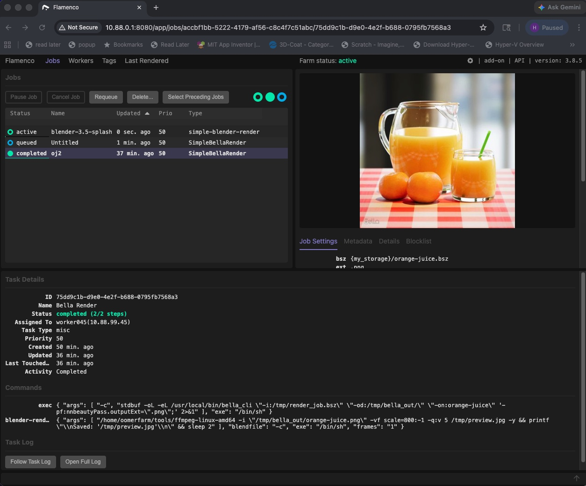

# Deploy Flamenco renderfarm on cheap hourly cloud rentals with VPN setup

>### Script tested on AWS, Google, Azure, Vultr, TensorDock, Vast 


[ WORK IN PROGRESS, Alpha v0.2 ]

WARNING: Bootstrap scripts take over the entire Linux device. Will BREAK a Linux already in use.

- [Flamenco](https://flamenco.blender.org) provides the actual renderfarm functionality while these scripts complement it with network storage, security and cli deployment.
- Meant to help an artist scale up render resources quickly and cheaply
- [Bellarender](https://bellarender.com) 25.3.0, Blender 5.1.0 are installed on workers



>Renderfarms have a lot of moving parts; these parts are wrangled down to 4 scripts.

<span style="color:cyan;">bolstersecurity.sh</span> = create VPN keys on your computer<sub>(Mac/Win/Linux)</sub>

<span style="color:cyan;">bootstrapmanager.sh</span> = VPN router, network share and flamenco-manager <sub>(Linux)</sub>

<span style="color:cyan;">bootstrapworker.sh</span> = VPN and render node<sub>(Linux)</sub>

<span style="color:cyan;">joinfarm.sh</span> = connect to VPN on your computer<sub>(Mac/Win/Linux)</sub>

---
## Computers Needed
- <span style="color:cyan;">Device A</span> => your Mac/Win/Linux Blender workstation
- <span style="color:cyan;">Device B</span> => AlmaLinux 8.x/9.x/10.x 
    - Doesn't render, just adds network storage and dispatches jobs
- <span style="color:cyan;">Device 1-100</span> => cpu/gpu AlmaLinux 8.x/9.x/10.x . Spin machines up and down to match your needs.
---

## Run scripts in terminal/cli 
- bash scripts run natively on MacOS/Linux
- Windows requires [git-scm](https://git-scm.com) to get bash

1. <span style="color:green;">**bash bolstersecurity.sh**</span> on <span style="color:cyan;">Device A</span> <sup>(Mac/Win/Linux)</sup> 

   - generate Nebula VPN keys, encrypts with openssl
   - Drop encrypted bundles to Google Drive, "Anybody with link" share to easly deploy to Flamenco-manager and all Flamenco-workers
2. <span style="color:green;">**bash bootstrapmanager.sh**</span> on <span style="color:cyan;">Device B</span><sup>(Linux)</sup> 
        
      - install Nebula VPN router
      - starts flamenco-manager
      - adds network share

Rough guide of things to be done on flamenco manager server.
 Heed warnings and follow instructions.
```   
dnf update -y 
dnf install git -y
git clone https://github.com/oomer/oomerfarm-flamenco.git 
cd oomerfarm-flamenco
bash bootstrapmanager.sh
```

3. <span style="color:green;">**bash joinfarm.sh**</span> on <span style="color:cyan;">Device A</span><sup>(Mac/Win/Linux)</sup> 
        
     - Get VPN ip address 10.88.10.1
     - mount smb://10.88.0.1/oomerfarm Mac/Linux
        - mount \\10.88.0.1\oomerfarm Windows
                - map this as the O: drive
     - Network share username:oomerfarm password:oomerfarm

     - Connect to Flamenco Manager at http://10.88.0.1:8080 
     - Submit jobs using Blender->Flamenco add-on 
     - Or via REST API http://10.88.0.1//api/v3/jobs
        
4. <span style="color:green;">**bash bootstrapworker.sh**</span> on <span style="color:cyan;">Computer 1-100</span> hourly rentals<sup>(Linux)</sup> [ Fresh Linux install only, messes production machine ]

     - joins [Nebula](https://github.com/slackhq/nebula) VPN
     - starts flamenco-worker 
     - installs Blender and Bellarender

Rough outline of things to be done on each worker node. Heed warnings and follow instructions.
```
dnf update -y
dnf install git openssl -y
git clone https://github.com/oomer/oomerfarm-flamenco.git 
cd oomerfarm-flamenco
bash bootstrapworker.sh
```
## Summary

4 bash scripts for jumpstarting your personal renderfarm.

- bolstersecurity.sh <sup>Mac/Win/Linux</sup>
- bootstrapmanager.sh <sup>Linux management/storage server</sup>
- joinfarm.sh <sup>Mac/Win/Linux</sup>
- bootstrapworker.sh <sup>Linux render worker</sup>

## Tips

- reboot after bootstrap scripts
- Heed bootstrap script warnings and follow instructions.
- Store your farm.encrypted.keys and worker.encrypted.keys on Google Drive. "Anyone with a link" share

## Compute Charge Caveat
- You will be charged the the hour or by the month if you forget to destroy your Virtual Machines. Remember to destroy.

## Security notes <sup>( review source code )</sup>

- Uses [Nebula](https://github.com/slackhq/nebula) to overlay a private network across the internet to hide your (**http**)  flamenco-manager and (**smb**) network storage access.
- servers and workers enforce SELinux and any traffic other than 22/tcp and 42042/udp are dropped by the firewall
- Your workstation's VPN is alive only while **joinfarm.sh** runs. 
- Each worker has ALL worker keys to simplify mass deployment. They are trusted as a group. 
- not all cloud vendors scrub their drives after each rental allowing the next renter to possible retrieve passwords and keys present on the disk