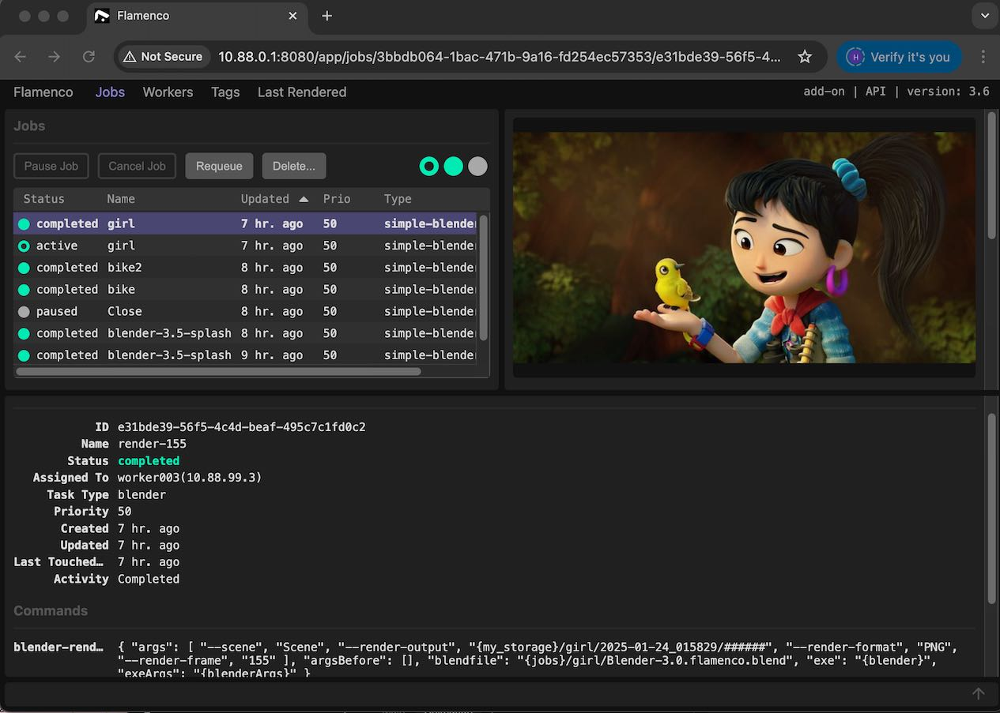

# Guided scripts for deploying a Flamenco renderfarm 

[ WORK IN PROGRESS ]
[ ALPHA release v0.1 ]

>#### A family of helpers scripts for DIY renderfarms to take advantage of cheap hourly cloud compute.

### oomerfarm-flamenco adds https://flamenco.blender.org
- Flamenco provides the actual renderfarm functionality while these scripts complement it with network storage, security and cli deployment.
- Oomerfarm's goal is to streamline the process so it is plausible to build and dismantle your personal renderfarm every other week.
- [Bellarender](https://bellarender.com) 24.6.1, Blender 4.3.2 are installed on workers

>Renderfarms have a lot of moving parts; these parts are wrangled down to 4 scripts.

bolstersecurity.sh = manage VPN security keys (Mac/Win/Linux)

bootstrapmanager.sh = setup network storage and flamenco-manager (Linux)

bootstrapworker.sh = setup flamenco-worker (Linux)

joinfarm.sh = connect to private network(Mac/Win/Linux)

#### Security notes ( review the code yourself )

- Uses [Nebula](https://github.com/slackhq/nebula) to overlay a private network across the internet to hide your (**http**)  flamenco-manager and (**smb**) network storage access.
- servers and workers enforce SELinux and any traffic other than 22/tcp and 42042/udp are dropped by the firewall
- Nebula group access fence packets from cloud computers
- Your workstation's connection is alive only while **joinfarm.sh** is running. 

> Note while bolstersecurity.sh and joinfarm.sh run on Mac/Win/Linux, flamenco-manager and and flamenco-worker will only be deployed via bootstrapmanager.sh and bootstrapworker.sh on Linux.

---
## Computers Needed
- Computer A => Mac/Win/Linux Blender workstation
- Computer B => a Alma/Rocky 8.x/9.x Linux server: 
    - Doesn't render, just adds network storage and dispatches jobs
    - [RECOMMENDED] run a a cheap monthly server [see lowendtalk.com](https://lowendtalk.com/categories/offers)
    - OR run on a mini pc at home and port forward [42042] on your router 
- Computer 1-100 => cpu/gpu Alma/Rocky 8.x/9.x Linux hourly rentals [example](https://tensordock.com/)
    - OR Add your local Linux computers 
---

## Run scripts in terminal/cli 
- bash scripts run natively on MacOS/Linux
- Windows requires [git-scm](https://git-scm.com) to get bash

1. **bash bolstersecurity.sh** on Computer A (Mac/Win/Linux) 

        - generates keys for Nebula overlay network
   - then put encrypted keys on Google Drive, share publicly
2. **bash bootstrapmanager.sh** on Computer B(Linux)
        
        - joins Nebula overlay network
        - launches flamenco-manager
        - provides network storage 

3. **bash joinfarm.sh** on Computer A(Mac/Win/Linux)
        
        - joins Nebula overlay network
        - mount smb://10.88.0.1/oomerfarm Mac/Linux
        - mount \\10.88.0.1\oomerfarm Windows
                - map this as the O: drive
                - edit /home/oomerfarm/flamenco-manager.yaml if needed
        - http://10.88.0.1:8080 from your workstation set Shared Storage to /mnt/oomerfarm/flamenco

4. **bash bootstrapworker.sh** on Computer 1-100 hourly rentals(Linux)

        - joins Nebula overlay network
        - launches flamenco-worker
        - installs Blender and bellarender
        - [NOTE] ensure worker names are numerically unique workerxxx to avoid IP address clash
        - [SECURITY NOTE] each worker has ALL worker keys to simplify mass deployment. They are trusted as a group. 

5. Blender 
        - Blender install Flamenco add-on from webpage
        - Set Manager URL to http://10.88.0.1:8080 
        - In Output tab -> Flamenco  submit 
        - get your images

## Summary

4 bash scripts for jumpstarting your personal renderfarm.

- bolstersecurity.sh Mac/Win/Linux
- bootstrapmanager.sh Linux management/storage server
- bootstrapworker.sh Linux render worker
- join.sh Mac/Win/Linux

## Compute Charge Caveat
- You will be charged the the hour or by the month if you forget to destroy your Virtual Machines. Remember to destroy.
- [TODO] Add auto destroy timer ( Google preemptible VMs only )

## Security note
- not all cloud vendors scrub their drives after each rental allowing the next renter to possible retrieve passwords and keys present on the disk
- [TODO] Add the ability to encrypt the disk at rest
- [TODO] Add dead man's script, that on shutdown, keys are wiped ( Since cloud may use COW filesystem, this is weak sauce)